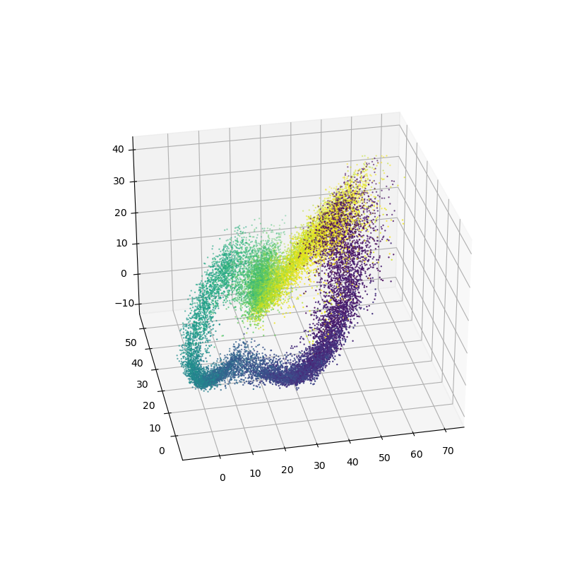

# Manifold learning for HD cells with non-gaussian prior Variational AutoEncoders

inspired by 
R. Chaudhuri, B. Gercek*, B. Pandey*, A. Peyrache, I.R. Fiete. [The intrinsic population dynamics of a canonical cognitive circuit. Nature Neurosci. (2019)](https://www.nature.com/articles/s41593-019-0460-x).
Dimitris Kalatzis, David Eklund, Georgios Arvanitidis, and Søren Hauberg.[Variational Autoencoders with Riemannian Brownian Motion Priors. arXiv. (2020)](https://arxiv.org/abs/2002.05227)

<h2>Acknowledgement</h2>
Part of the code was lifted verbatim from https://github.com/dimkal89/rvae and https://github.com/FieteLab/SPUD_Analysis-of-manifold-structure-in-head-direction-data

Big thank you for the Authors!!👍

